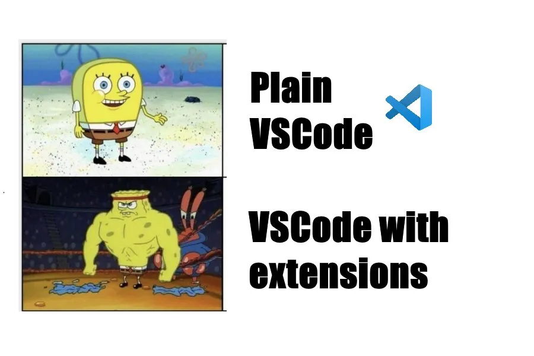
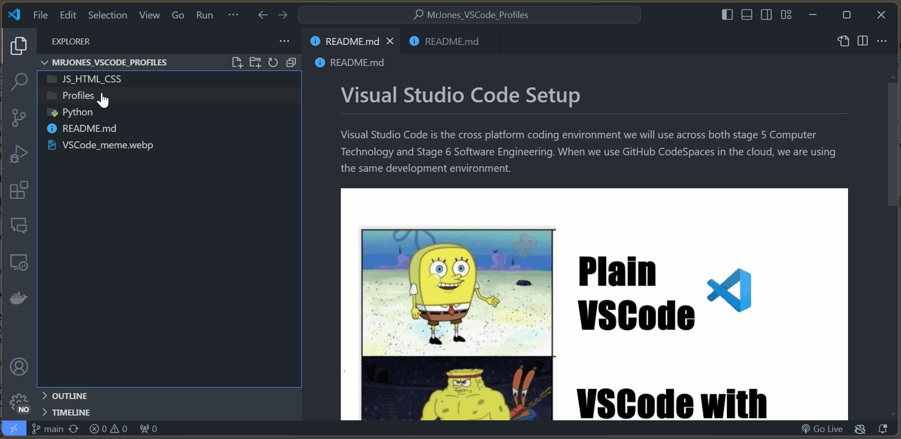

# Visual Studio Code Setup
<table cellspacing="0" cellpadding="0" style="border: none!important;">
  <tr cellspacing="0" cellpadding="0" style="border: none!important;">
    <td style="border: none!important;">
Visual Studio Code is the cross platform coding environment we will use across both stage 5 Computer Technology and Stage 6 Software Engineering. When we use GitHub CodeSpaces in the cloud, we are using the same development environment.
</td>
    <td style="border: 0px solid #fff!important;">

</td>
  </tr>
</table>

## Configuration Files

- [JS_HTML_CSS](\JS_HTML_CSS) configuration files
- [Python](\Python) configuration files

## Important Visual Code Settings

### Profiles

- [Default](/Profiles/Default.code-profile)
- [Arduino](/Profiles/Arduino_Development.code-profile)
- [Micropython](/Profiles/MicroPython_Pico_Development.code-profile)
- [node.JS](/Profiles/Node.js_PWA_Development.code-profile)
- [Python](/Profiles/Python_Flask_PWA_Development.code-profile) including FLASK
- [Unity](/Profiles/Unity_Development.code-profile)

> [!IMPORTANT]
> All profiles require the _Default_ profile as the base profile.
